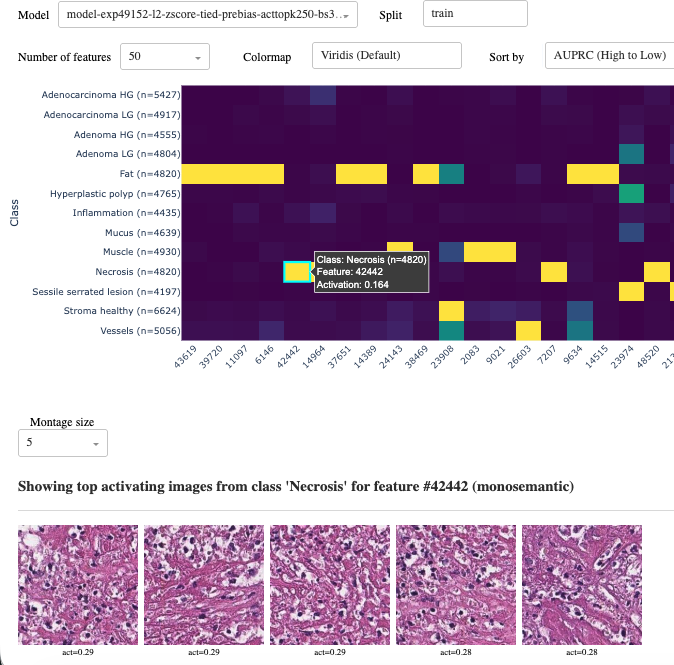
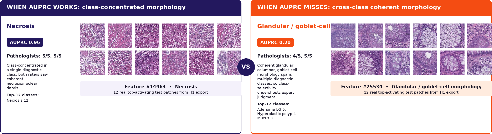

# Histoscope

**Expert-grounded inspection of sparse autoencoder features in histopathology foundation models.**

[Paper](https://openreview.net/forum?id=UIqw2I1CQk) | [PDF](paper/histoscope_icml2026.pdf) | [Evaluation protocol](protocol/EVALUATION_PROTOCOL.md) | [SAE configuration](configs/uni_spider_topk250.json) | [Example panels](examples) | [Citation](#citation)

Histoscope is an interactive dashboard for examining sparse autoencoder (SAE) features learned from pathology foundation-model embeddings. It connects feature activations to tissue classes and to the image patches that activate each feature most strongly, allowing domain experts to inspect whether a feature represents a coherent morphological concept.



The accompanying study used a fixed TopK SAE trained on UNI embeddings from SPIDER-colorectal and a blinded two-pathologist review of 100 confidence-stratified features. Histoscope's AUPRC rule precisely identified class-concentrated features, but missed coherent morphology that appeared across diagnostic classes. The paper therefore recommends using class selectivity to prioritize inspection rather than to remove low-selectivity features from view.

### Reviewed examples



## Release contents

| Component | Location | Notes |
|---|---|---|
| Histoscope dashboard | [`histoscope/`](histoscope) | Heatmap, patch browser, feature, cluster, flipper, and report views |
| Study applications | [`apps/`](apps) | Vocabulary-builder and blinded rating interfaces |
| SAE and artifact pipeline | [`pipeline/`](pipeline) | Train the SAE and generate the caches consumed by Histoscope |
| SAE configuration | [`configs/`](configs) | Exact architecture and training configuration used in the paper |
| Evaluation protocol | [`protocol/`](protocol) | Vocabulary, rater instructions, thresholds, and feature-sampling procedure |
| Reviewed examples | [`examples/`](examples) | Real top-activating patch panels used for qualitative illustration |
| Workshop paper | [`paper/`](paper) | Camera-ready ICML Mechanistic Interpretability Workshop paper |
| Checkpoint and caches | [`models/README.md`](models/README.md) | Distributed separately; never stored in Git |

The release does **not** contain raw rater responses or the 100-feature expert-label dataset. Those annotations form part of a later extended study. SPIDER images and UNI weights are also not redistributed here.

## Quick start

Histoscope requires a model directory containing the generated interactive cache described in [`models/README.md`](models/README.md).

```bash
git clone https://github.com/mnhcorp/histoscope.git
cd histoscope
python -m venv .venv
source .venv/bin/activate
pip install -r requirements.txt

python histoscope.py --models-dir /path/to/sae-models
```

Open <http://localhost:8050>. Image paths recorded in the interactive cache must resolve locally for patch views to render.

Optional patch descriptions use the Gemini API when `GEMINI_API_KEY` is set. MedGemma support additionally requires `transformers` and can be enabled with `--medgemma`; neither integration is required for the dashboard's core inspection workflow.

## End-to-end pipeline

Histoscope is the final visualization stage, not the artifact generator. The complete path is:

```text
cached UNI embeddings -> TopK SAE training -> feature analysis/cache export -> Histoscope
```

[`pipeline/run_pipeline.py`](pipeline/run_pipeline.py) chains training and analysis using the paper configuration. It can also skip training and build the dashboard artifacts from the released checkpoint. Exact commands and input layout are documented in [`pipeline/README.md`](pipeline/README.md).

## Model receipt

The paper's SAE maps 1,024-dimensional UNI embeddings to a 49,152-feature dictionary using tied encoder/decoder weights, a learned pre-encoder bias, and per-patch TopK activation with `k=250`. It was trained for two epochs with batch size 32, learning rate `1e-4`, seed 42, z-score normalization, and row-wise L2 normalization. Test embeddings use training-split normalization statistics in the corrected release pipeline.

The machine-readable receipt is [`configs/uni_spider_topk250.json`](configs/uni_spider_topk250.json). The checkpoint download and checksum will be added to [`models/README.md`](models/README.md) once the large release artifact is uploaded.

## Evaluation protocol

The released protocol includes:

- the controlled morphology vocabulary and its seven top-level families;
- rater-facing instructions and rating scales;
- the prespecified AUPRC, margin, and recall thresholds;
- the confidence-stratified feature-sampling procedure; and
- the Gradio applications used to construct the vocabulary and collect blinded ratings.

Start with [`protocol/EVALUATION_PROTOCOL.md`](protocol/EVALUATION_PROTOCOL.md). This protocol is provided for replication and extension; it should not be interpreted as a release of the original expert annotations.

## Repository layout

```text
histoscope/       Dash dashboard
apps/             Gradio vocabulary and rating applications
pipeline/         SAE training and Histoscope artifact generation
configs/          Model and preprocessing receipts
protocol/         Evaluation protocol and controlled vocabulary
examples/         Real reviewed-feature patch panels
models/           External checkpoint/cache instructions
paper/            Workshop paper
```

## Citation

```bibtex
@inproceedings{hossain2026histoscope,
  title     = {Histoscope: Expert-Grounded Inspection of Sparse Autoencoder Features in Histopathology Foundation Models},
  author    = {Hossain, Mirza Nasir and Bell, Sarah L. and Bryson, Gareth and Harris-Birtill, David},
  booktitle = {Mechanistic Interpretability Workshop at the 43rd International Conference on Machine Learning},
  year      = {2026},
  url       = {https://openreview.net/forum?id=UIqw2I1CQk}
}
```

## Scope

Histoscope is research software for inspecting learned representations. It is not a medical device and must not be used for clinical diagnosis or decision-making without further validation.

## License

Histoscope source code is released under the [GNU General Public License v3.0](LICENSE). Upstream datasets, model weights, and image assets remain subject to their own terms.
